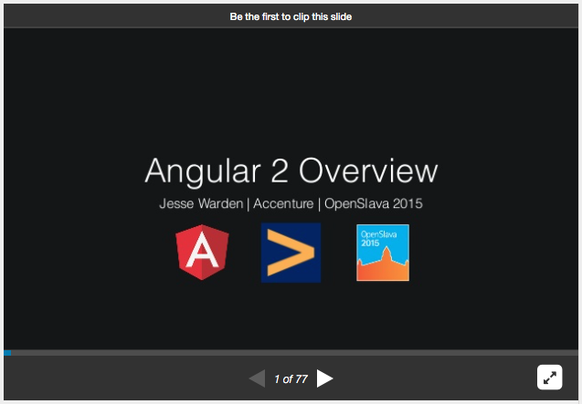

# Angular 2 Overview for Open Slava 2015

My slidedeck for [Angular 2](https://angular.io/) Overview presentation that I gave at the [Open Slava 2015](http://www.openslava.sk/2015/) conference.

You can also [see the slides online](http://www.slideshare.net/jesterxl/angular-2-overview).

# Resources

- [Angular 2 website](https://angular.io/
)
- [John Papa's simple Angular 2 repo](https://github.com/johnpapa/angular2-go)
- [Thomas Manion WebPack Angular 2 + WebPack repo](https://github.com/1337programming/)
- [Victor Savkin's awesome blog about Angular 2](http://victorsavkin.com/)
- [Another great blog about Angular 2](http://blog.thoughtram.io/)
- [TypeScript Handbook](http://www.typescriptlang.org/Handbook
)
- [ES6 Features](https://github.com/lukehoban/es6features)